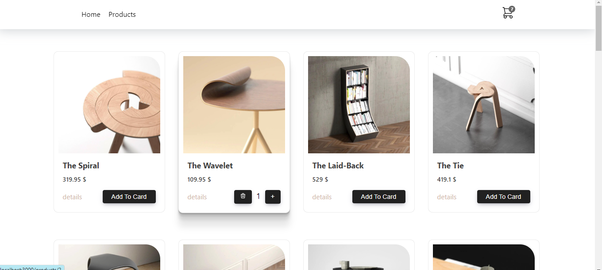

# Welcome to my React Shop👋

## Available Scripts

In the project directory, you can run:
### `npm start`

## Table of contents

- [Overview](#overview)
  - [The challenge](#the-challenge)
  - [Screenshot](#screenshot)
  - [Links](#links)
- [My process](#my-process)
  - [Built with](#built-with)
  - [What I learned](#what-i-learned)
  - [Continued development](#continued-development)
  - [Useful resources](#useful-resources)
- [Author](#author)
- [Acknowledgments](#acknowledgments)

## Overview

Thanks for checking out my React Shop project.
Remember that "Every day is a learning day" and try to learn from everyone! 

 ### Screenshot 



<!-- ### Links -->

<!-- - Live Site URL: [React Sign Up | Login Form Application](https://melodic-cactus-7d3a19.netlify.app/) -->

## My process

### Where to find resources

The first think to do is to look for your perfect design! So let's checkout [dribble](https://dribbble.com/) for our favourite design to begin!

### Built with

- Reactjs
- Hooks
- Contexts
- Style modules
- CSS
- Flexbox
- CSS Grid

You can use any tools you like to help you complete the project. So if you got something you'd like to practice, feel free to give it a try. However, i made it responsive for all the devices, since my users should be able to: View the optimal layout depending on their device's screen size

### What I learned

This projects helped me being more familiar with the details of react, how to work with hooks in cart and shop and handle errors together with giving styles through style modules and inline styles and use my css knowledge as well to create a responsive project with small details on colors,sizes and so on.

To see parts of my codes and see how you can add code snippets, see below:

``` JSX

     
import styles from "./Product.module.css";

const Product = ({productData}) => {

    const {state, dispatch} = useContext(CartContext);

    return (
        <div className={styles.container}>
            
            <h3>{shortTitle(productData.title)}</h3>
            <p>{productData.price} $</p>
            <div className={styles.linkContainer}>
            <Link to={`/products/${productData.id}`}> details</Link>
            <div className={styles.buttonContainer}>
                {
                    quantityCount(state, productData.id) > 1 &&  <button className={styles.decreseBtn} onClick={()=> dispatch({type: "DECREASE", payload: productData})}>-</button>
                }
                {
                    quantityCount(state, productData.id) === 1 &&  <button className={styles.deleteBtn} onClick={()=> dispatch({type: "REMOVE_ITEM", payload: productData})}></button>
                }
                {
                    quantityCount(state, productData.id) > 0 && <span className={styles.counter}>{quantityCount(state, productData.id)}</span>
                }
                {
                    isInCart(state, productData.id) ?
                    <button className={styles.increaseBtn} onClick={()=> dispatch({type: "INCREASE", payload: productData})}>+</button> :
                    <button className={styles.addToCartBtn} onClick={()=> dispatch({type: "ADD_ITEM", payload: productData})}>Add To Card</button>
                }
            </div>
            </div>
        </div>
    );
};

```
```css

  .buttonContainer button {
    background-color: black;
    border: none;
    color: #fff;
    height: 28px;
    border-radius: 4px;
    cursor: pointer;
    transition: all 0.2s ease;
    width: 28px;
    font-size: 1.6rem !important;
    line-height: 24px;
    box-shadow: rgba(50, 50, 93, 0.25) 0px 4px 12px -2px,
      rgba(0, 0, 0, 0.3) 0px 3px 7px -3px;
    margin-left: 5px;
  }
  
  .buttonContainer img {
    width: 20px;
  }
`;

```

### Useful resources

In order to do this project in a correct way you need to have a good knowledge of html and css, js and reactjs so let's master at them with these fruitful resources.

- [w3schools](https://www.w3schools.com/) - This helps you a lot with both your css and html which is easy to read and has numerous examples.
- [MDN](https://developer.mozilla.org/en-US/) - Remember that no matter how many tutorial videos you have watched, you always need to learn details and features from codes documentations
- [codeacademy](https://www.codecademy.com/)
- [udemy](https://www.udemy.com/) - Here you can find a number of tutorials in different languages
- [coursera](https://www.coursera.org/)

## Author

- Website - [Elle Famkar](https://bespoke-marigold-f2f8e3.netlify.app/)
- Twitter - [@Ellefamkar](https://www.twitter.com/ellefamkar)

Feel free to ask any questions come to your mind  and send me message via my current temporary website in the link above!

## Acknowledgments

I am thankful to each and every person in this area who teaches me a single piece of code! I learn every single day from amazing people! so I need to thank you all ❤

**Have fun using this project!** 🚀
